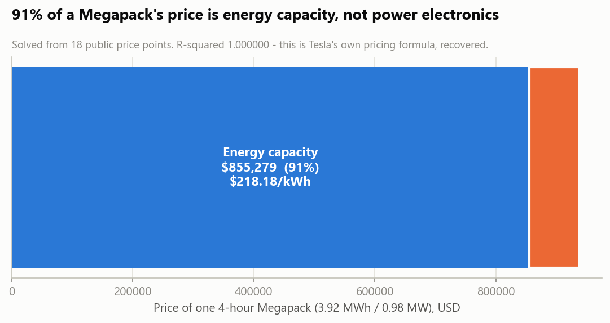
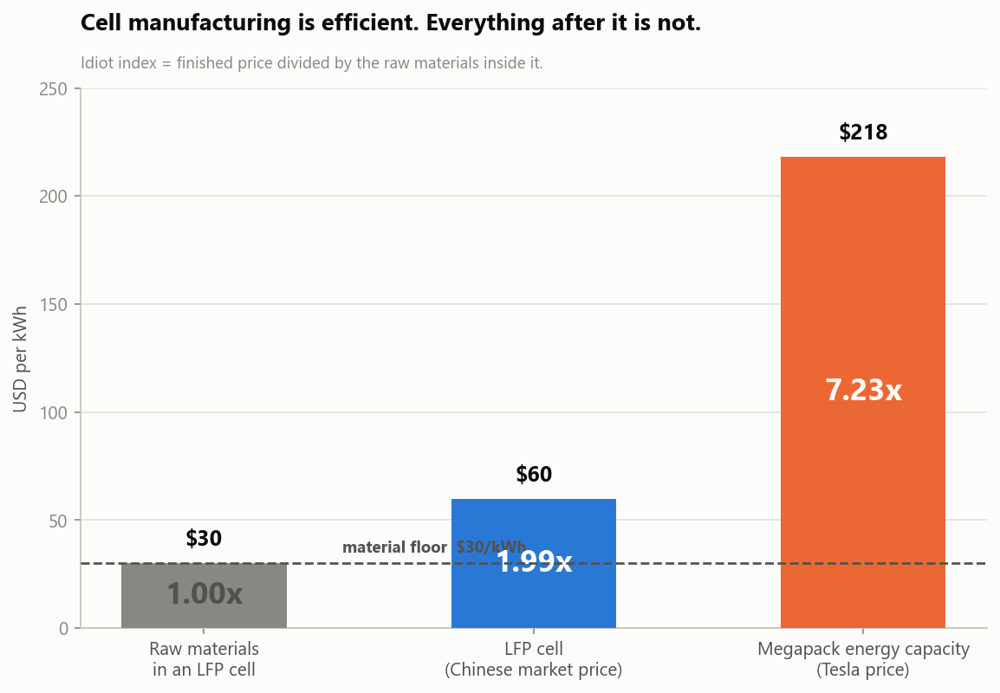
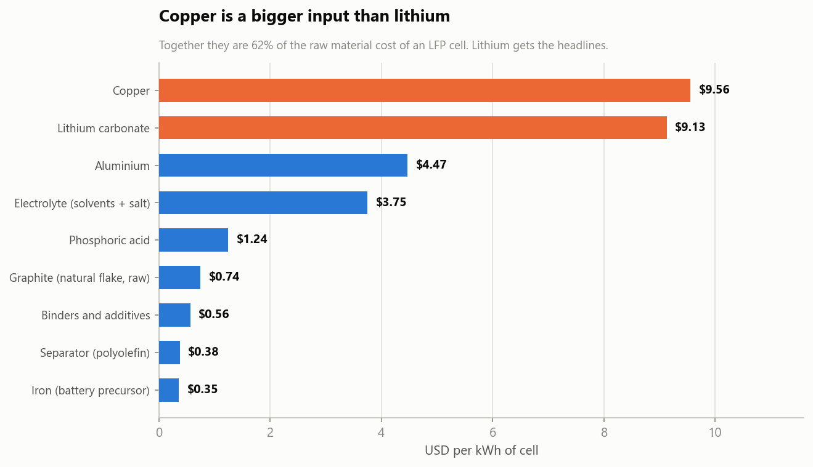

# Megapack Price Decomposition & LFP Localisation

**What is actually inside a Megapack's price, and should its cells be imported or made domestically?**

Read [MEMO.md](MEMO.md) for the findings. This file covers method, data and how to run it.

---

## Headline result

Tesla's published Megapack prices decompose exactly into:

| Component | Small order (1–5) | Volume (20–50) |
|---|---|---|
| Energy capacity | **$218.18 / kWh** | $204.13 / kWh |
| Power conversion | **$84.38 / kW** | $78.95 / kW |
| Fixed order charge | $24,373 | $22,796 |

**R² = 1.000000, worst residual under 0.001%, across 18 overdetermined observations.**

91% of a 4-hour Megapack's price is energy capacity — so that's where sourcing risk lives.



## How the decomposition is possible

Tesla sells the same hardware two ways:

| Config | Power/unit | Energy/unit |
|---|---|---|
| 2-hour | 1.92 MW | 3.86 MWh |
| 4-hour | 0.98 MW | 3.92 MWh |

Nearly identical energy, half the power. Any price difference between them is
attributable to power-conversion hardware rather than cells, which is enough to
solve `price = fixed + a·kWh + b·kW`.

**Why this isn't just algebra on two numbers.** Two equations with two unknowns fit
perfectly by construction and prove nothing. The model is fitted by least squares
across 18 of the 24 observed prices — the two linear volume tiers, 3 unknowns each,
with the 7/10/15-unit points on the discount step left out — heavily overdetermined, so the
residuals are a real test. It fits perfectly anyway, which means the decomposition
recovers the pricing formula rather than approximating it.

## Where the markup sits

Idiot index — finished price ÷ the raw materials inside it:

| Level | $/kWh | Index |
|---|---|---|
| Raw materials in an LFP cell | $30.19 | 1.00× |
| LFP cell (Chinese market price) | $60.00 | **1.99×** |
| Megapack energy capacity (Tesla price) | $218.18 | **7.23×** |

Cell manufacturing is already near its material floor. The room is downstream of
the cell, not inside it — which also means the localisation case rests on tariffs
and tax credits rather than on out-manufacturing China.



**Copper is a bigger raw input than lithium** ($9.56 vs $9.13/kWh); together they're
62% of material cost.



Material intensities are literature approximations, so they're validated by
stoichiometry: the lithium implied by the assumed cathode mass works out to
0.468 kg LCE/kWh against an independently published 0.47 — **99.7% agreement**
between two figures derived from different sources.

## Three things that fell out

- **Volume discount caps at ~20 units.** About 9% off the single-unit price, flat
  thereafter. Energy and power rates both drop exactly 6.4% between tiers.
- **The factory is visible in the price list.** State pricing correlates **0.971**
  with distance from Lathrop, CA. Hawaii and Puerto Rico sit above the line — ocean freight.
- **No expediting premium exists.** All four 2027 delivery quarters price identically.

## Data

Tesla's public pricing endpoint, the same one the order configurator calls:

```
GET tesla.com/api/energy/ecg/megapackPricing
    ?megapackCount=…&megapackVariation=2hXL|4hXL
    &megapackDeliveryDate=2027+Q1&stateCode=CA
```

Captured 2026-09-19: 24 quantity points, 12 states, 4 delivery quarters. Prices
exclude taxes and installation. Raw capture with provenance notes is in
`../data/raw/megapack_pricing_grid_2026-09-19.json`.

Per-unit specs were confirmed linear against the configurator UI at two different
order sizes before being relied on.

## Assumptions

Every input to the localisation model lives in [assumptions.json](assumptions.json),
each tagged:

- `sourced` — taken from a cited public document (tariff rates, 45X amounts, FEOC thresholds)
- `estimate` — a judgement call with a stated low/central/high range, varied in the Monte Carlo

The softest input is the US manufacturing cost uplift (1.30× central, 1.15–1.60× range).
Break-even sits at 1.93×, so the conclusion survives the full range. Nothing is
hardcoded in the model code — change a value here and re-run.

## Running it

Requires Python 3.10+, `pandas`, `numpy`, `matplotlib`, `openpyxl`.

```bash
python src/decompose_price.py      # least-squares decomposition + freight gradient
python src/idiot_index.py          # raw material floor, three-level idiot index
python src/localization_model.py   # import vs domestic, decision surface, Monte Carlo
python src/make_charts.py          # nine charts
python src/build_excel.py          # assemble the workbook
```

Each script prints its own findings and writes to `output/`.

## What's in `src/`

| File | Does |
|---|---|
| `decompose_price.py` | Fits price into energy/power/fixed by volume tier; tests the freight-gradient hypothesis against distance from Lathrop |
| `idiot_index.py` | Prices the raw material basket in an LFP cell, validates it by stoichiometric cross-check, computes the index at cell and system level |
| `localization_model.py` | Landed-cost comparison, break-even uplift, decision surface, 45X phase-down, 20,000-draw Monte Carlo, FEOC value at risk |
| `make_charts.py` | Seven charts on a colourblind-safe palette; diverging ramp only where the quantity has a sign |
| `build_excel.py` | Thirteen-sheet workbook including a flattened, provenance-tagged view of every assumption |

## Output

`output/megapack_cost_analysis.xlsx` is the deliverable for anyone who doesn't want to
run Python. Leads with method and caveats, includes the full assumptions table, and
embeds all seven charts. Every table is also written as a standalone CSV.

## Known limitations

- Decomposes **price**, not cost. Converting requires a margin assumption, made
  explicitly in the localisation model rather than smuggled in here.
- US cost uplift, freight, plant capex and utilisation are estimates, not sourced
  figures. All are varied in the Monte Carlo and tagged in `assumptions.json`.
- Tariff and tax-credit rules are current as of September 2026 and are moving
  targets. Re-check before relying on any conclusion.
- The FEOC analysis prices the credit at risk; it does not model whether a specific
  bill of materials passes the material-assistance ratio.
- State-premium distances are straight-line to state centroids, so the freight
  gradient is indicative rather than a shipping model.
