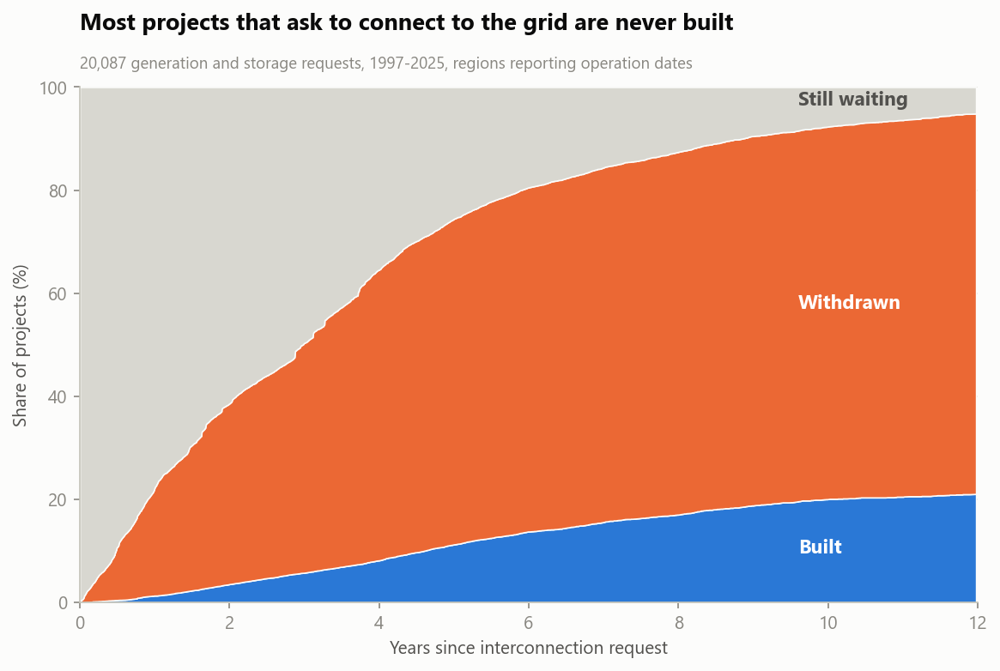
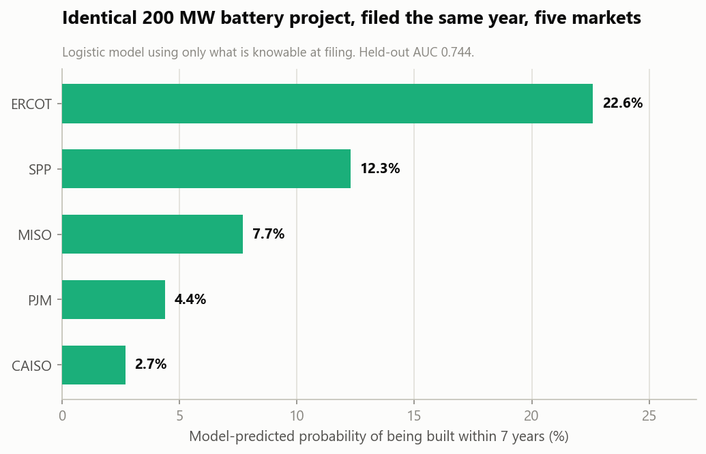
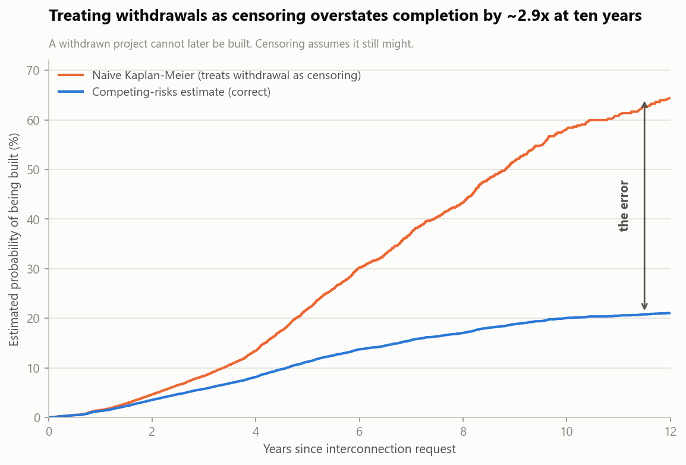

# Interconnection Queue Survival Analysis

**What predicts whether a US grid project ever gets built?**

Competing-risks survival analysis of 20,087 generation and storage interconnection
requests, 1997–2025. Read [MEMO.md](MEMO.md) for the findings; this file covers how
it works and how to run it.

---

## Headline result

| Years after request | Built | Withdrawn | Still waiting |
|---|---|---|---|
| 5 | **11.2%** (95% CI 10.8–11.7) | 63.2% | 25.6% |
| 10 | **20.0%** (19.3–20.8) | 72.3% | 7.7% |

An identical 200 MW battery project has a 22.6% chance of being built in ERCOT and
2.7% in CAISO.





## The two things this analysis gets right that most don't

**1. Withdrawal is a competing risk, not censoring.**
A project leaves the queue either by being built or by being withdrawn. Standard
Kaplan-Meier treats withdrawal as censoring — "we stopped watching, it might still
happen." It can't. That error inflates the ten-year completion estimate from 20.0%
to 58.0%, a 2.9x overstatement. This uses Aalen-Johansen cumulative incidence,
implemented from scratch in `src/survival.py` (~40 lines) so the method is
inspectable rather than a library call.



**2. Four regions don't report commercial operation dates.**
ISO-NE reports zero COD dates across 227 operational projects; West, NYISO and
Southeast report 20–49%. Including them yields a confident, false conclusion that
those markets build nothing. `src/build_dataset.py` measures reporting coverage per
region and excludes anything below 90%. The excluded regions and the threshold are
both documented in the output.

## Data

**Lawrence Berkeley National Laboratory, *Queued Up* 2026 Edition**, data through
year-end 2025. Compiled by LBNL and GridTracker covering 7 ISOs/RTOs and 50 utilities
(~98% of US generating capacity). Licensed **CC BY 4.0**.

Source file: `../data/raw/LBNL_Ix_Queue_Data_File_thru2025.xlsx` (14.85 MB), downloaded
from <https://emp.lbl.gov/queues>.

## Running it

Requires Python 3.10+, `pandas`, `numpy`, `scikit-learn`, `matplotlib`, `openpyxl`,
`pyarrow`.

```bash
python src/profile_data.py       # inspect the workbook, cache it, check date coverage
python src/build_dataset.py      # scope, outcome coding, missingness + reporting audits
python src/diagnostics.py        # interrogate suspicious results before trusting them
python src/survival.py           # competing-risks estimates, bootstrap CIs
python src/completion_model.py   # logistic models + calibration + scenario
python src/make_charts.py        # six charts
python src/build_excel.py        # assemble the workbook
```

Each script prints its own findings and writes to `output/`. They run in order and
each depends on the previous one's cache.

## What's in `src/`

| File | Does |
|---|---|
| `profile_data.py` | Reads the raw workbook, caches to parquet, profiles date-field completeness |
| `build_dataset.py` | Scope filters, outcome/duration coding, missingness audit, regional reporting-quality flag |
| `diagnostics.py` | Tests whether the ISO-NE and battery results are artifacts. Both were. |
| `survival.py` | Aalen-Johansen CIF and naive Kaplan-Meier from scratch, bootstrap CIs, group breakdowns |
| `completion_model.py` | Two logistic models (request-time only vs. with IA milestone), calibration, worked scenario |
| `make_charts.py` | Six charts on a colourblind-safe palette |
| `build_excel.py` | Assembles everything into one reviewable workbook |

## Output

`output/interconnection_queue_analysis.xlsx` is the deliverable for anyone who doesn't
want to run Python — eleven sheets, leading with method and caveats, with all six charts
embedded. Alongside it, every table is also written as a standalone CSV.

## Known limitations

- ~30% of operational and ~35% of withdrawn projects lack an outcome date and are
  excluded from duration estimates. `data/processed/missingness_audit.csv` compares
  dropped against kept rows: they're similar on size and cohort year, so the bias
  appears mild, but it isn't zero.
- Battery and Solar+Battery entered the queue mostly after 2019. Their five-year
  estimates rest on a few hundred mature projects and will move as cohorts age. Every
  group table carries `n_observed_5yr` so thin estimates are visibly thin.
- The logistic model is associational. It ranks and forecasts; it does not establish
  that filing in ERCOT *causes* a project to succeed.
- "Suspended" projects are grouped with active rather than treated as terminal, on the
  basis that suspended projects can resume. Reversible at the top of `build_dataset.py`.
